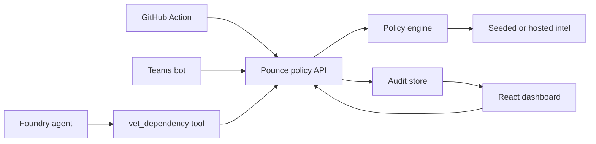

# Pounce Sentinel Architecture

Pounce Sentinel has one source of truth for dependency and tool-action policy: the Python policy API in `services/policy-api`. Every integration calls that API and receives the same verdict contract.

## Components

- **Policy API:** Azure Functions-compatible Python service. Locally, it uses seeded intel and a file-backed audit log. In Azure, it can be connected to Cosmos DB, Key Vault, and App Insights.
- **Dashboard:** React app for security engineers and hackathon judges. It visualizes protection status, recent verdicts, blocked dependencies, and feed health.
- **GitHub Action:** PR gate that inspects dependency file changes and calls `vet-dependency` before allowing a merge.
- **Foundry tool:** OpenAPI definition for a Foundry agent tool named `vet_dependency`.
- **Teams bot:** Human-facing command surface for `status`, `explain`, and `approve` workflows.
- **Azure infrastructure:** Bicep templates define Functions, Cosmos DB, Key Vault, App Insights, Static Web Apps, and supporting app settings.

## Data flow

## Local-first behavior

The scaffold is intentionally useful without Microsoft credentials:

- Seeded intel provides deterministic allow, warn, and block cases.
- Audit records are written to `.pounce-sentinel/verdicts.jsonl` by default.
- The dashboard can render bundled demo data.
- Foundry, Teams, and Azure docs describe where account values will be connected later.

## Future cloud behavior

When a real Microsoft account is added:

- Azure Functions hosts the API.
- Cosmos DB stores verdicts, exceptions, and feed state.
- Key Vault stores integration secrets.
- App Insights receives structured verdict telemetry.
- Static Web Apps hosts the dashboard.
- Foundry imports `integrations/foundry/openapi.yaml`.
- Teams app registration points to `apps/teams-bot`.

